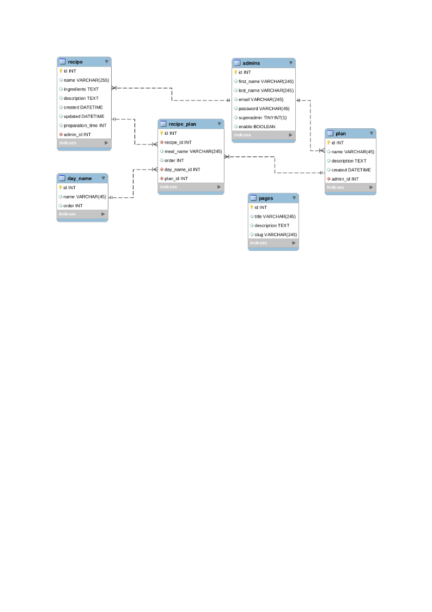
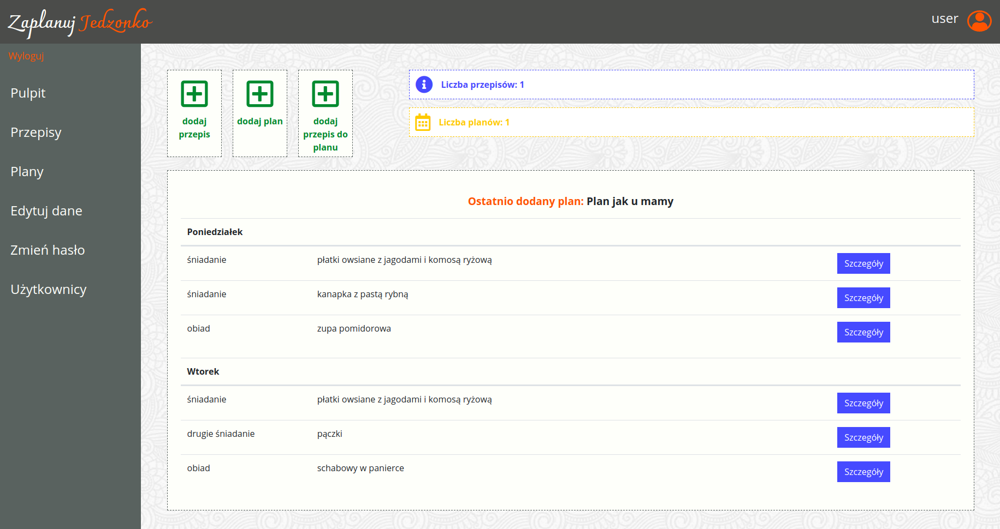
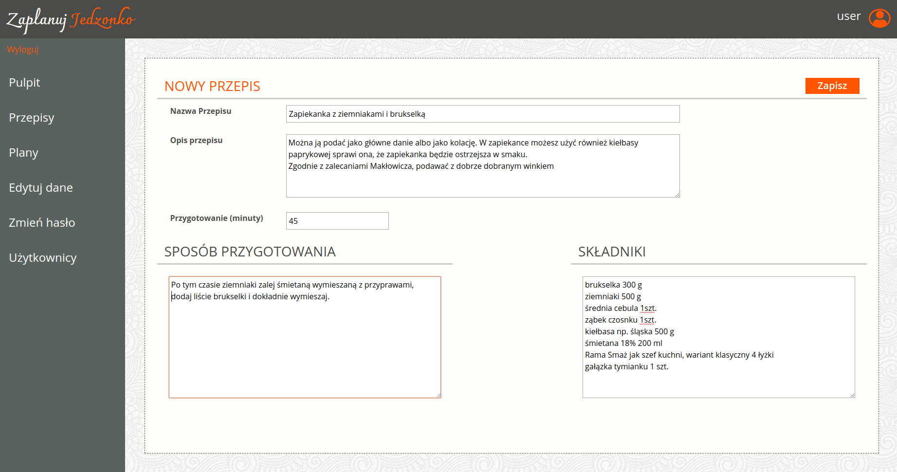
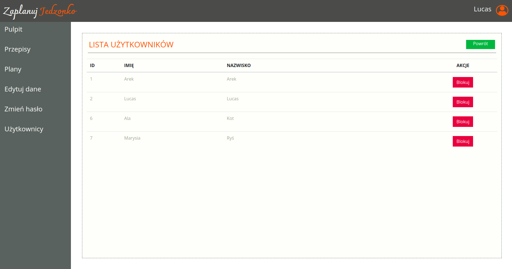

# Recipe App (Servlets)
RecipeApp application for adding and managing nutritional plans and recipes.

## Table of contents
* [General info](#general-info)
* [Screenshots](#screenshots)
* [Technologies](#technologies)
* [Setup](#setup)
* [Features](#features)
* [Status](#status)

## General info
Pair Programming with Jerzy Palka: https://github.com/kudini.  
A project created to learn about the Scrum methodology and practice group work on Github.

## Screenshots

## Technologies
* Java
* Servlets
* JavaServer Pages (JSP, ready template in html)
* Data access layers in the form of DAO classes
* MySQL databases

## Setup
* Download files
* Configure Local Tomcat server with deployment as war:exploded
* Start app in IDE, browser should open automaticly on landing page

## Features
* registration
* logging in
* adding, modyfing and deleting recipes
* displaying a list of recipes
* creating, viewing and modyfing a nutrition schedule
* browsing and blocking users by administrator
* meal list managment for logged user

## Status
Project is finished
